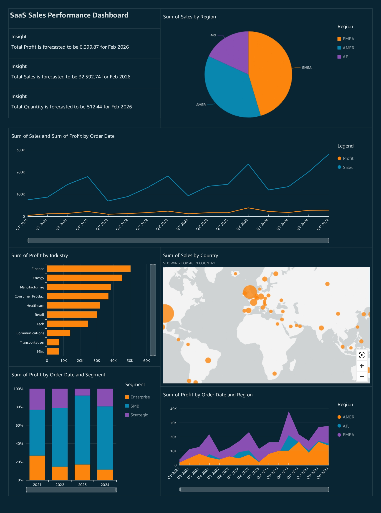

# Data Visualization & Dashboard Projects

Welcome to my dashboard repository! This space is dedicated to showcasing various data visualization and business intelligence projects I have created. Each project features a unique dataset and aims to uncover meaningful insights through carefully designed dashboards.

---

## Project 1: SaaS Sales Performance Dashboard

This dashboard provides a comprehensive analysis of sales data for a fictional SaaS company. The goal is to offer a high-level overview of business performance, highlighting key trends in sales, profit, and customer behavior across different regions and industries.

**Tool:** Amazon QuickSight

### Key Insights from the Dashboard

*   **Overall Performance:** Sales show a consistent upward trend, though with a recurring dip in the first quarter of each year. The profit margin has remained relatively stable despite fluctuations in sales.

*   **Regional Performance:** The **AMER** region is the primary driver of both sales and profit. The **EMEA** region, while smaller, has demonstrated significant profit growth, indicating strong potential.

*   **Industry Profitability:** **Finance** and **Energy** are the most profitable industries, suggesting these are key markets for the company.

*   **Customer Segments:** The **SMB** (Small and Medium-sized Business) segment consistently generates the largest share of the company's profit.

### Dataset

The dataset for this analysis, `SaaS-Sales.csv`, can be accessed here:
[**Download Dataset**](https://render.skillbuilder.aws/cds/9b2debad-aee9-4b76-91ff-7d68c51e53a9/assets/SaaS-Sales.csv)

---
*(More projects will be added here soon.)*